slidenumbers: true

# React Advanced

---

# Jiayi Hu

Front-end developer & consultant

- Twitter: [@jiayi_ghu](https://twitter.com/jiayi_ghu)
- Github: [@jiayihu](https://github.com/jiayihu)
- Email: [jiayi.ghu@gmail.com](mailto:jiayi.ghu@gmail.com)

---

# Requirements

- JavaScript ES6
- React base

---

# TOC

1. TypeScript
2. Redux
3. CSS-in-JS

---

[.background-color: #007ACC]

# TypeScript


---

# Benefits

- Static type-checking
  - Correctness by construction
- Auto-documenting code without comments (JSDoc)
- Improved DX
  - Inline errors and autocomplete
  - Refactoring

---

# Downside

- Integration with existing libraries
  - Community [@types](https://github.com/DefinitelyTyped/DefinitelyTyped)
- Getting the right type can often be difficult

---

# Compiler options - tsconfig.json

```json
{
  "compilerOptions": {
    "target": "es5",
    "lib": [
      "esnext",
      "DOM",
      "DOM.Iterable"
    ],
    "allowJs": true,
    "skipLibCheck": true,
    "esModuleInterop": true,
    "allowSyntheticDefaultImports": true,
    "noUnusedLocals": true,
    "noUnusedParameters": true,
    "strict": true,
    "forceConsistentCasingInFileNames": true,
    "module": "commonjs",
    "moduleResolution": "node",
    "resolveJsonModule": true,
    "noEmit": true,
    "jsx": "react"
  }
}
```

---

# --strict

```
--noImplicitAny
--noImplicitThis
--alwaysStrict
--strictBindCallApply
--strictNullChecks
--strictFunctionTypes
--strictPropertyInitialization
```

---

# Playground

[typescriptlang.org/play/](https://www.typescriptlang.org/play/)

---

# Type annotations

```ts
function toString(num: number): string {
  return String(num);
}
```

Type assertion

```ts
function toString(num: number): string {
  return num as string;
}
```

Inference

```ts
function toString(num: number) {
  return String(num);
}
```

---

# Basic primitive types

- `boolean, number, string`
- `object`, `Array`
- `undefined, null`
- `any`
- `unknown`, `never`

^ any is like Godfather, forgiving but better not to ask

---

# Type alias

```ts
type Name = string
const inspector: Name = 'Lestrade'
```

```ts
type Id = number
function generateId(): Id {
  return Math.random();
}
```

---

```ts
type Id = number
const generateId: () => Id = () => {
  return Math.random();
}
```

---

# Arrays

```ts
const sample: number[] = [1, 2, 3];
```

```ts
const sample: Array<number> = [1, 2, 3];
```

```ts
const tuple: [number, number, number] = [1, 2, 3];
```

---

# Tuple

```ts
function useState(initialState: number): [number, (newState: number) => void] {
  const setState = (x: number) => {
    console.log(x)
  }

  return [2, setState]
}

const [state, setState] = useState(2)
```

---

# Objects

```ts
const user: { id: string, name: string, age: number, email: string } = {
  id: 'glestrade',
  name: 'Inspector Lestrade',
  age: 40,
  email: 'glestrade@met.police.uk',
}
```

---

```ts
type User = { id: string, name: string, age: number, email: string }

const user: User = {
  id: 'glestrade',
  name: 'Inspector Lestrade',
  age: 40,
  email: 'glestrade@met.police.uk',
}
```

---

# Union type

```ts
type User = { id: string, name: string, age: number, email: string | null }

const user: User = {
  id: 'glestrade',
  name: 'Inspector Lestrade',
  age: 40,
  email: null
}
```

\\^ Strict null checks

---

# Literal types

```ts
type User = {
  id: string;
  name: string;
  age: 40;
  gender: 'male' | 'female';
  email: string | null
};

const user: User = {
  id: 'glestrade',
  name: 'Inspector Lestrade',
  age: 40,
  gender: 'male',
  email: null,
};
```

---

# Enums

```ts
enum Gender {
  Male = 'male',
  Female = 'female'
}

type User = {
  id: string;
  name: string;
  age: 40;
  gender: Gender;
  email: string | null
};

const user: User = {
  id: 'glestrade',
  name: 'Inspector Lestrade',
  age: 40,
  gender: Gender.Male,
  email: null,
};
```

---

# Enums

```ts
enum LogLevel {
  OFF,
  INFO,
  WARNING,
  ERROR
}

function setLogLevel(level: LogLevel): void {

}

setLogLevel(LogLevel.ERROR)
```

```ts
setLogLevel(33)
```

---

# Interface

```ts
interface User {
  id: string,
  name: string,
  age: number,
  email: string | null
}

const user: User = {
  id: 'glestrade',
  name: 'Inspector Lestrade',
  age: 40,
  email: null
}
```

---

# Extend Interface

```ts
interface User {
  id: string,
  name: string,
  age: number,
  email: string | null
}

interface AdminUser extends User {
  privilegies: 'admin'
}
```

---

# Structural typing - Polymorphism

```ts
interface User { id: string, name: string, age: number, email: string | null }

interface Inspector { id: string, name: string, age: number, email: string | null }

const user: User = { id: 'glestrade', name: 'Inspector Lestrade', age: 40, email: null }

const inspector: Inspector = { id: 'glestrade', name: 'Inspector Lestrade', age: 40, email: null }

function printUserName(user: User) {
  console.log(user.name);
}

printUserName(user)
printUserName(inspector)
printUserName({ id: 'glestrade', name: 'Inspector Lestrade', age: 40, email: null })
printUserName({ id: 'mholmes', name: 'Mycroft Holmes', age: 40, gender: 'male', email: null })
```

---

# Object keys

```js
interface User {
  id: string;
  name: string;
  age: number;
  email: string | null;
  \[key: string]: any;
}

function printUserName(user: User) {
  console.log(user.someProp);
}

printUserName({ id: 'mholmes', name: 'Mycroft Holmes', age: 40, gender: 'male', email: null });
```

---

# Type parameters

aka Generics

```ts
type Nullable<T> = T | null
type User = { id: string, name: string, age: number, email: Nullable<string> }
```

```ts
type Optional<T> = T | undefined
type User = { id: string, name: string, age: number, email: Optional<string> }
```

```ts
type User = { id: string, name: string, age: number, email?: string }
```

---

# Type parameters

```ts
type Queue<T> = {
  head: T,
  tail: T[]
}
```

```ts
const queue: Queue<string> = {
  head: 'A',
  tail: ['B', 'C']
}
```

---

# Generics

```ts
interface Queue<T> {
  head: T,
  tail: T[]
}
```

```ts
const queue: Queue<string> = {
  head: 'A',
  tail: ['B', 'C']
}
```

---

# Generics

```ts
class Stack<T> {
  private stack: Array<T> = [];

  public push(x: T): void {
    this.stack.push(x);
  }

  public pop(): T {
    return this.stack.length ? this.stack.pop() : null;
  }

  public get length() {
    return this.stack.length;
  }
}
```

```ts
const queue = new Stack<number>()
```

---

# Implementing interfaces

```ts
interface IQueue<T> {
  head: T,
  tail: T[]
}

class Queue<T> implements IQueue<T> {
  public head: T
  public tail: T[]

  constructor(head: T) {
    this.head = head
    this.tail = []
  }
}
```

---

# Function type parameters

```ts
function id<T>(x: T): T {
  return x;
}

const id: <T>(x: T) => T = x => x
```

```ts
const name = id<string>('name')
```

---

# React Component

```ts
type ReactElement<P> = {
  type: string;
  props: P;
  key: string | null;
}
type Component<P extends object> =
  (props: P) => ReactElement<P> | null;
```

---

# React Component

```js
interface Props {
  color: 'string',
  onClick: string,
  children: React.ReactNode
}

function Button(props: Props) {
  return (
    <div 
      className={props.color === 'primary' ? 'btn btn-primary' : 'btn'}
      onClick={props.onClick}
    >
      {props.children}
    </div>
  )
}
```

---

# Real useState

```ts
type Dispatch<A> = (value: A) => void;
type SetStateAction<S> = S | ((prevState: S) => S);

function useState<S>(initialState: S | (() => S))
  : [S, Dispatch<SetStateAction<S>>];
```

---

# Array<T>

```ts
interface Array<T> {
  map<U>(callbackfn: (value: T, index: number) => U): U[];
}
```

```ts
interface Array<T> {
  reduce<U>(callbackfn: (accumulator: U, currentValue: T, currentIndex: number) => U, initialValue: U): U;
}
```

```ts
interface Array<T> {
  filter<S extends T>(callbackfn: (value: T, index: number) => value is S): S[];
}
```

---

# Type guard

```ts
function isString(x: unknown): boolean {
  return typeof x === 'string'
}

const teacherName: unknown = 'Jiayi'

if (isString(teacherName)) {
  console.log(teacherName.toUpperCase());
}
```

```ts
function isString(x: unknown): x is string {
  return typeof x === 'string'
}
```

---

```ts
type SimpleUser = {
  id: string;
  name: string;
  role: 'simple-user';
};

type AdminUser = {
  id: string;
  name: string;
  role: 'admin-user';
  privilegies: ['edit', 'delete']
};

type User = SimpleUser | AdminUser

const users: User[] = [
  {
    id: 'glestrade',
    name: 'Inspector Lestrade',
    role: 'simple-user'
  },
  {
    id: 'mholmes',
    name: 'Mycroft Holmes',
    role: 'simple-user'
  },
  {
    id: 'iadler',
    name: 'Irene Adler',
    role: 'admin-user',
    privilegies: ['edit', 'delete']
  }
];

const adminUsers = users.filter(user => user.role === 'admin-user')
```

---

```ts
function isAdmin(user: User): user is AdminUser {
  return user.role === 'admin-user'
}

const adminUsers = users.filter(isAdmin)
```

---

# What is a type

> A type defines the set of values a variable can take.

---


```typescript
const age: number = 23
const name: string = 'Jiayi'
const user: { name: string, age: number } =
  { name: 'Jiayi', age: 23 }
```

---


```typescript
type User = { name: string, age: number }

const user: User = { name: 'Jiayi', age: 23 }
```

---

# Structural subtyping


```typescript
const user: User = {
  name: 'Jiayi',
  age: 23
}

const surnameUser: SurnameUser = {
  name: 'Jiayi',
  age: 23,
  surname: 'Hu'
}

const birthdayUser: BirthDayUser = {
  name: 'Jiayi',
  age: 23,
  birthday: new Date()
}
```

^ if two types are **structurally** identical they are seen as compatible.

---

# Structural subtyping

```typescript
function isAdultUser(user: User): boolean {
  return user.age >= 18
}

isAdultUser(user) // Okay
isAdultUser(surnameUser) // Okay
isAdultUser(birthdayUser) // Okay
```

---

# Literal types


```typescript
const visa: 'visa' = 'visa'
const mastercard: 'mastercard' = 'mastercard'
```

^ Always have the smallest set possible

---

# Union types / Sum types

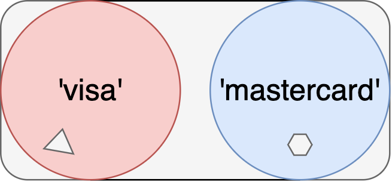

```typescript
type PaymentMethod = 'visa' | 'mastercard'
```

---


```typescript
type User = { name: string, surname: string }
type WithAge = { age: number }
```

---

# Union types

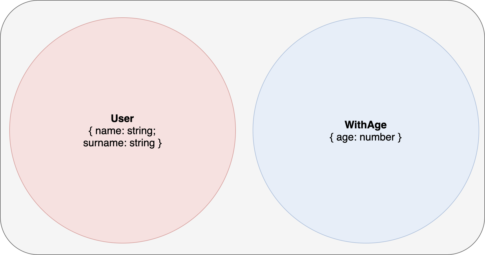

```typescript
type UserOrWithAge = User | WithAge
```

---

# Intersection types


```typescript
type UserWithAge = User & WithAge
```

---

# Unknown vs never

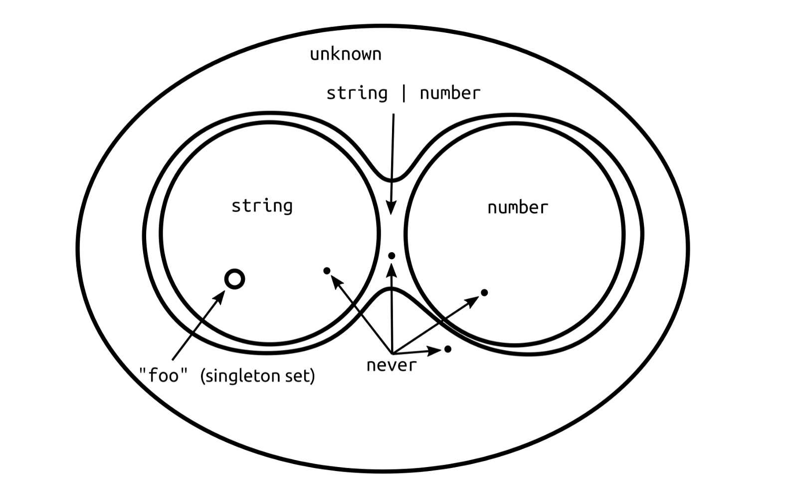

---

# Every possible TypeScript type

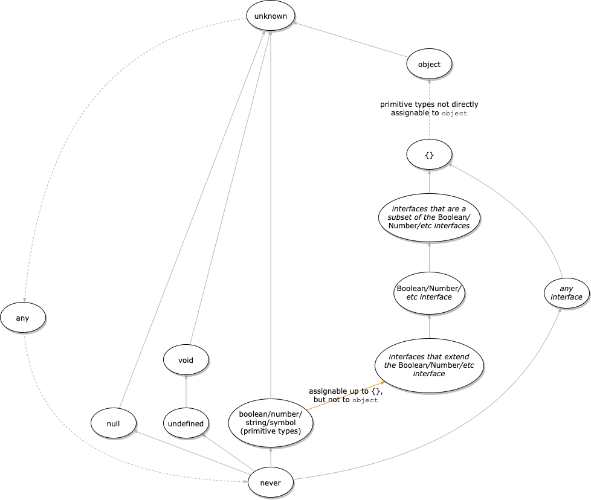

---

[.background-color: #9B59B6]


# Redux
## State Management Library


---

# Problemi senza Redux

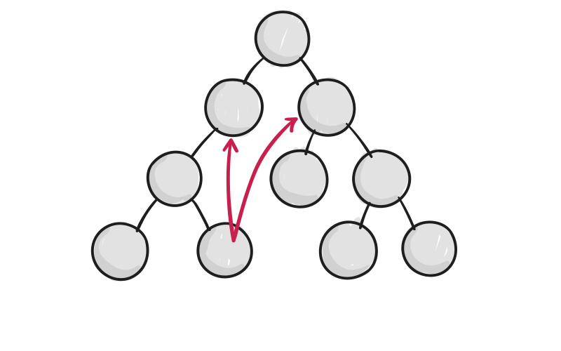
  
- Communicazione tra componenti
- Passaggio di dati ed API a più componenti

---


---

# Flux

## Unidirectional Data-Flow


---

# Unidirectional Data-Flow
  
- Maggior controllo del data-flow: Action > State > View
- Two-way data-binding: State <> View
- Il two-way data-binding è molto comodo, ma può diventare imprevedibile il data-flow

---

# Data-flow di Redux


---

Redux rende i mutamenti allo State prevedibili

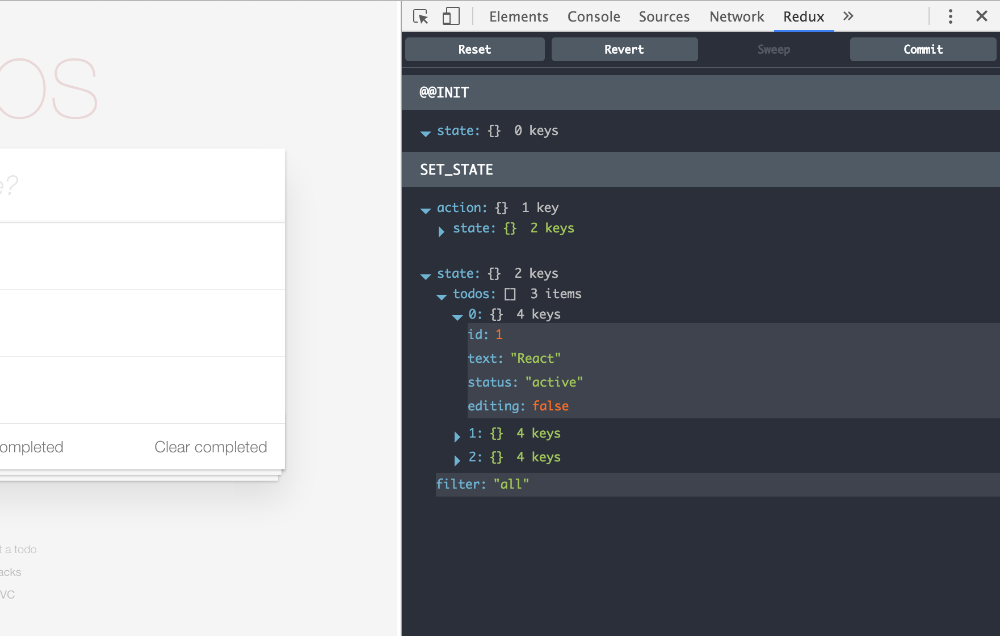

---

# I 3 principi core di Redux

1. Unico *Source of Truth*: lo **Store**
2. Ogni intento di modifica dello Store deve essere esplicito: **action**
3. Le funzioni che modificano lo Store sono **solo** funzioni pure: **reducers**

---

# Actions
  
- Sono l'unico modo per comunicare una modifica dello State
- Sono semplici oggetti, che descrivono solamente l'intenzione di modificare lo State
- Vengono mandati allo Store via `store.dispatch(action)`

---

# Action 

```js
const deposit = {
  type: 'DEPOSIT', // Obbligatorio
  payload: { // Flux Standard Action
    amount: 10
  }
};
```

---

# Action creator

```js
function deposit(amount) {
  return {
    type: 'DEPOSIT',
    payload: { amount: amount }
  };
}
```

---

# Reducers
  
- **(previousState, action) => newState**
- Sono funzioni pure che accettano lo State attuale, l'action e restituiscono un nuovo State
- Il nome deriva dalla funzione [reduce](https://developer.mozilla.org/en-US/docs/Web/JavaScript/Reference/Global_Objects/Array/Reduce) degli array

---


# In un reducer non bisogna mai:
  
1. Modificare i parametri, soprattutto lo State precedente
2. Effettuare side-effects come chiamate API al server
3. Effettuare azioni non deterministiche

---

# Reducer

```js
const currentState = {
  balance: 20,
  operations: [{...}, {...}]
};
const initialState = {
  balance: 0,
  operations: []
}

function reducer(currentState = initialState, action) {
  switch (action.type) {
    case 'DEPOSIT':
      return Object.assign({}, currentState, {
        balance: currentState.balance + action.payload.amount
      });
    default:
      return currentState;
  }
}

const newState = {
  balance: 30,
  operations: [{...}, {...}, {...}]
};
```

---

# Lo Store
  
- Contiene lo State dell'applicazione
- Permette la lettura dello State via **store.getState()**
- Permette la modifica dello State via **store.dispatch(action)**
- Permette di sottoscriversi agli update via **store.subscribe(listener)**


---

# Store

```js
import { createStore } from 'redux';

const store = createStore(reducer, initialState);
```

---

# Single State Tree

```js
const state = {
  balance: 10000,
  operations: {
    deposits: [
      {
        amount: 1000,
        description: 'Pagamento fattura n. 002 🍻',
      },
    ],
    withdraws: [
      {
        amount: 500,
        description: 'Acquisto nuovo iPhone 7',
      },
    ],
  },
  user: {
    age: 32,
    currency: '$',
    firstName: 'Giovanni',
    lastName: 'Rossi',
    sex: 'male',
  },
};
```

---

# Why State POJO nello Store
  
- Facilità creare applicazioni universali
- Facilità debuggare o analizzare lo stato dell'applicazione
- Testabile => applicazioni solide

---

# Why State POJO nello Store

- Facilità persistere lo State come JSON in localStorage o inviato al server
- Miglior error logging/reporting in produzione
- Facilità time-travelling o undo/redo

---

# State immutable

- **NO** modifiche per riferimento
  1. `obj.a = 2;`
  2. `array.push(2)`
- Ogni modifica segna l'intero percorso come *dirty*

---

# You might not need Redux

1. User workflow semplici
2. No relazioni tra Context

---

# React Context

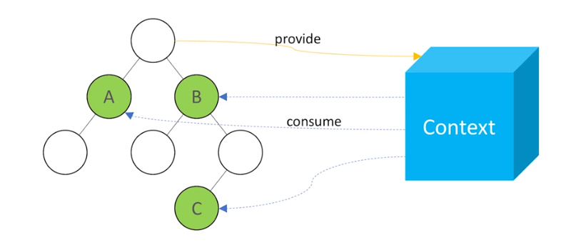

---

# Props drilling

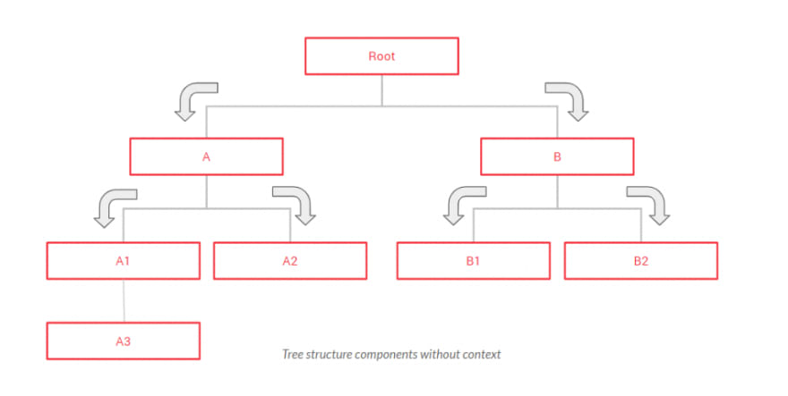

---

```jsx
const CurrencyContext = createContext();

export function useCurrency() {
  const currency = useContext(CurrencyContext);

  if (!currency) {
    throw new Error('Cannot be used outside of a CurrencyProvider');
  }

  return currency;
}

export function CurrencyProvider(props) {
  const [currency, setCurrency] = useState(null);
  const value = useMemo(() => [currency, setCurrency], [currency]);

  return (
    <CurrencyContext.Provider value={value} {...props}>
      {props.children}
    </CurrencyContext.Provider>
  );
}
```

---

# Context and Containers

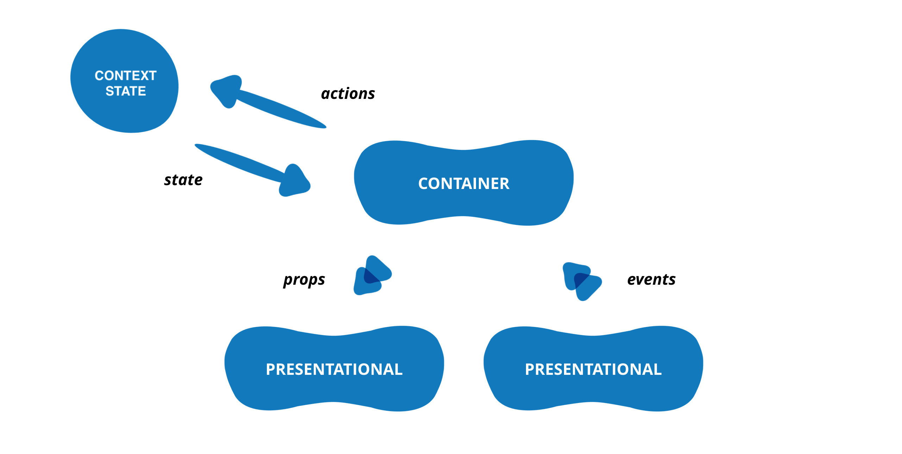

---

# With Redux

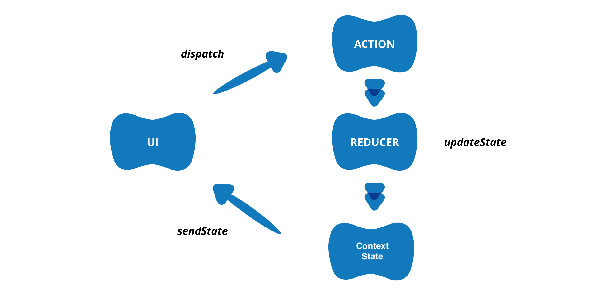

---

# With Redux

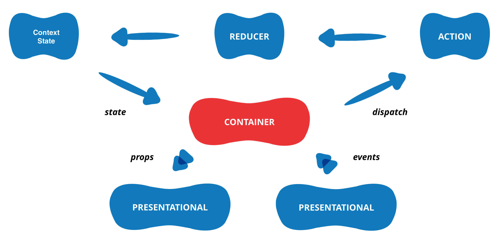

---

# Flux standard action

```typescript
interface FSA {
  type: string;
  payload?: any;
  error?: boolean;
  meta?: any;
}
```

- Action serializzabile
- Se `error: true` allora payload è l'oggetto errore

---

# Selectors

```jsx
const usersSelector = (state) => state.users;

function Users() {
  const users = useSelector(usersSelector);

  return (
    <div>
      {users.map(user => <span>{user.name}</span>)}
    </div>
  )
}
```

---

# Selectors

- Application state scalabile
- Essenziale per **computed derived state**
- Application state minimale e UI-indipendent
- Permette memoization ([reselect](https://github.com/reactjs/reselect))

---

```js
function filteredCustomers(state) {
  return state.customers.filter((customer) => customer.role === state.filterRole);
}

function customersInvoices(state, customers) {
  return customers.map((customer) => {
    return {
      customer: customer,
      invoices: state.invoices[customer.id],
    };
  });
}

function filteredCustomersInvoices(state) {
  const customers = filteredCustomers(state);

  return customersInvoices(state, customers);
}

```

---

# Reducer composition

Divide et Impera

---

```js
const state = {
  balance: 10000,
  operations: {
    deposits: [
      {
        amount: 1000,
        description: 'Pagamento fattura n. 002 🍻',
      },
    ],
    withdraws: [
      {
        amount: 500,
        description: 'Acquisto nuovo iPhone 7',
      },
    ],
  },
  user: {
    age: 32,
    currency: '$',
    firstName: 'Giovanni',
    lastName: 'Rossi',
    sex: 'male',
  },
};
```

---

# Reducer composition
  
- Divide lo State in porzioni più piccole, affidate a sotto-reducers
- Ogni sotto-reducer gestisce la sua porzione di state in maniera **indipendente**
- Migliora notevolmente la comprensione del reducer
- Più reducers possono reagire alla stessa action

---

# Implementazione pura

```js
function operationsReducer(state, action) {
  return {
    deposits: depositsReducer(state.deposits, action),
    withdraws: withdrawsReducer(state.withdraws, action),
  };
}

function rootReducer(state, action) {
  return {
    balance: balanceReducer(state.balance, action),
    operations: operationsReducer(state.operations, action),
    user: userReducer(state.user, action),
  };
}
```

---

# `combineReducers(reducersMap) => rootReducer`
  


---

# combineReducers

```js
import { combineReducers } from 'redux';

const rootReducer = combineReducers({
  balance: balanceReducer,
  operations: operationsReducer,
  user: userReducer,
});
```

---

# balanceReducer

```js
export default function balanceReducer(state = 0, action) {
  switch (action.type) {
    case actionTypes.DEPOSIT:
      return state + action.payload.amount;
    case actionTypes.WITHDRAW:
      return state - action.payload.amount;
    default:
      return state;
  }
}
```

---

# operationsReducer

```js
import { combineReducers } from 'redux';
import * as actionTypes from '../constants/actionTypes';

const initialState = {
  deposits: [],
  withdraws: [],
};

function depositsReducer(state = initialState.deposits, action) {
  switch (action.type) {
    case actionTypes.DEPOSIT:
      return state.concat(action.payload);
    default:
      return state;
  }
}

function withdrawsReducer(state = initialState.withdraws, action) {
  switch (action.type) {
    case actionTypes.WITHDRAW:
      return state.concat(action.payload);
    default:
      return state;
  }
}

const operationsReducer = combineReducers({
  deposits: depositsReducer,
  withdraws: withdrawsReducer,
});
```

---

# CSS-in-JS

---

# Issues with CSS at scale (@vjeux)

1. Global namespace
2. Dependencies
3. Dead code
4. Minification
5. Sharing constants
6. Non-determinism
7. Isolation

---

```css
.btn {
  display: inline-block;
  font-weight: 400;
  color: #212529;
  text-align: center;
  background-color: transparent;
  border: 1px solid transparent;
  padding: .375rem .75rem;
  font-size: 1rem;
  line-height: 1.5;
  border-radius: .25rem;
}

.btn-primary {
  color: #fff;
  background-color: #007bff;
  border-color: #007bff;
}
```

---

# 1. Global namespace

```css
.btn {
}

.btn-primary {
}
```

---

# CSS methodologies - BEM

```css
.btn {
}

.btn--primary {
}

.btn__text {}
```

---

# 2. Dependencies

```scss
$primary: $blue;
$secondary: $gray-900;
$success: $green;
$info: $cyan;
$warning: $yellow;
$danger: $red;
$light: $gray-200;
$dark: $gray-800;

$body-bg: $gray-200;
$body-color: $gray-600;

$input-btn-padding-y: 0.125rem;

@import 'bootstrap/scss/bootstrap.scss';
```

---

# Dependencies

```css
.app-nav {
  background-color: var(--light);
}

.app-nav .nav-link {
  color: var(--dark);
}
```

---

# 3. Dead code elimination

```css
.app-nav {
  background-color: var(--light);
}

.app-nav .nav-link {
  color: var(--dark);
}
```

---

# 4. Minification

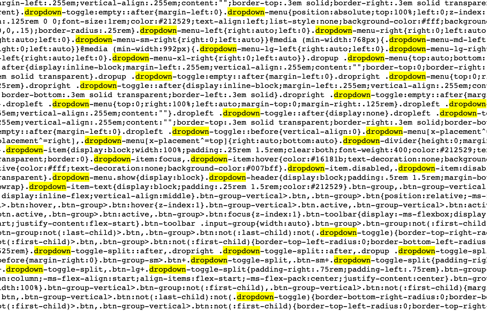

---

# 5. Constants

```css
.btn {
  color: #212529;
  padding: .375rem .75rem;
  font-size: 1rem;
  line-height: 1.5;
  border-radius: .25rem;
}

.btn-primary {
  color: #fff;
  background-color: #007bff;
  border-color: #007bff;
}
```

---

# 6. Non-deterministic resolution

```html

```

```css
.stock-logo {
  align-items: center,
  display: flex,
  justify-content: center,
  height: 50,
  overflow: hidden,
  text-align: center,
  width: 50,
}
```

```css
.transaction-logo {
  background-color: var(--light);
}
```

---

# 6. Non-deterministic resolution

```css
img.transaction-logo {
  background-color: var(--light);
}

.stock-logo {
  align-items: center,
  display: flex,
  justify-content: center,
  height: 50,
  overflow: hidden,
  text-align: center,
  width: 50,
}
```

---

# 7. Breaking isolation

```css
.app-nav .nav-link {
  color: var(--dark);
}
```

```css
.my-modal .modal-title {
  font-size: 2rem;
}
```

---

# CSS-in-JS

- Build-time
  - CSS Modules
  - Treat
- Inline styles
  - Radium
- Dynamic classNames
  - Styled-components
  - Emotion

---

# 1. Global namespace

```js
import { css } from '@emotion/css';

const btnStyle = css({
  display: 'inline-block',
  fontWeight: 400,
  color: '#212529',
  textAlign: 'center',
  backgroundColor: 'transparent',
  border: '1px solid transparent',
  padding: '.375rem .75rem',
  fontSize: '1rem',
  lineHeight: 1.5,
  borderRadius: '.25rem',
});
```

---

# 2. Dependencies

```js
import { css, cx } from '@emotion/css';
import { theme } from './theme';
import { navLinkStyle } from 'bootstrap';

const navStyle = css({
  backgroundColor: theme.colors.light;
})

const navLinkStyle = cx(navLinkStyle, css({
  color: theme.colors.dark
}))
```

---

# 3. Dead code elimination

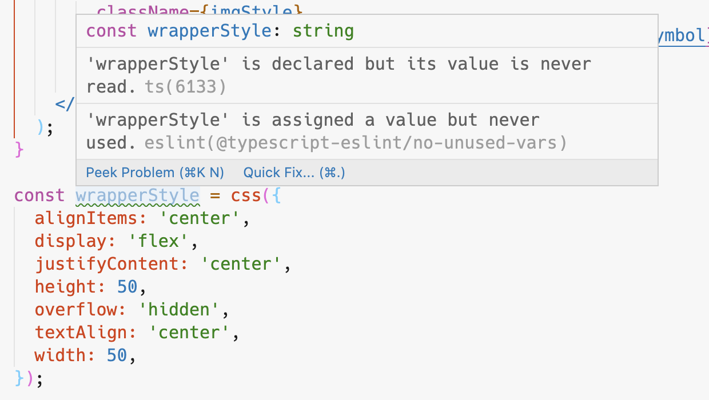

---

# 4. Minification

```js
const btnStyle = css({
  color: theme.colors.success;
})
```

```js
const textStyle = css({
  color: theme.colors.success;
})
```

```css
.css-w7jr6 {
  color: var(--success);
}
```

---

# 5. Constants

```js
import { css } from '@emotion/css';
import { theme } from './theme';

const navStyle = css({
  backgroundColor: theme.colors.light;
})
```

---

# 6. Non-deterministic resolution

```jsx

```

```js
const stockLogoStyle = css({
  alignItems: 'center',
  display: flex,
  justifyContent: 'center',
  height: 50,
  overflow: 'hidden',
  textAlign: 'center',
  width: 50,
})
```

```js
const transactionLogoStyle =  css({
  backgroundColor: theme.colors.light;
})
```

---

# 7. Breaking isolation

```js
const stockLogoStyle = css({
  alignItems: 'center',
  display: 'flex',
  justifyContent: 'center',
  height: 50,
  overflow: 'hidden',
  textAlign: 'center',
  width: 50,
})

const imgStyle = css({
  width: '75%'
})
```

---

# 8. Dynamic styles

```js
import React from 'react';
import { css, cx } from '@emotion/css';

export type SignedValueProps =  {
  value: number;
};

export function SignedValue(props: SignedValueProps) {
  const { value, className, ...spanProps } = props;

  const style = css({
    color: value >= 0 ? 'var(--success)' : 'var(--danger)',
  });

  const cn = cx(style, className);

  return (
    <span className={cn} {...spanProps}>
      {value > 0 ? '+' : '-'}
      {props.children}
    </span>
  );
}
```

---

# Thanks

